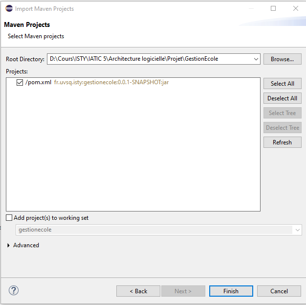
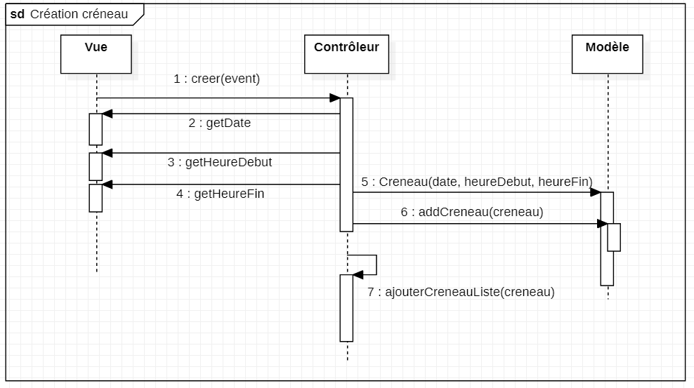
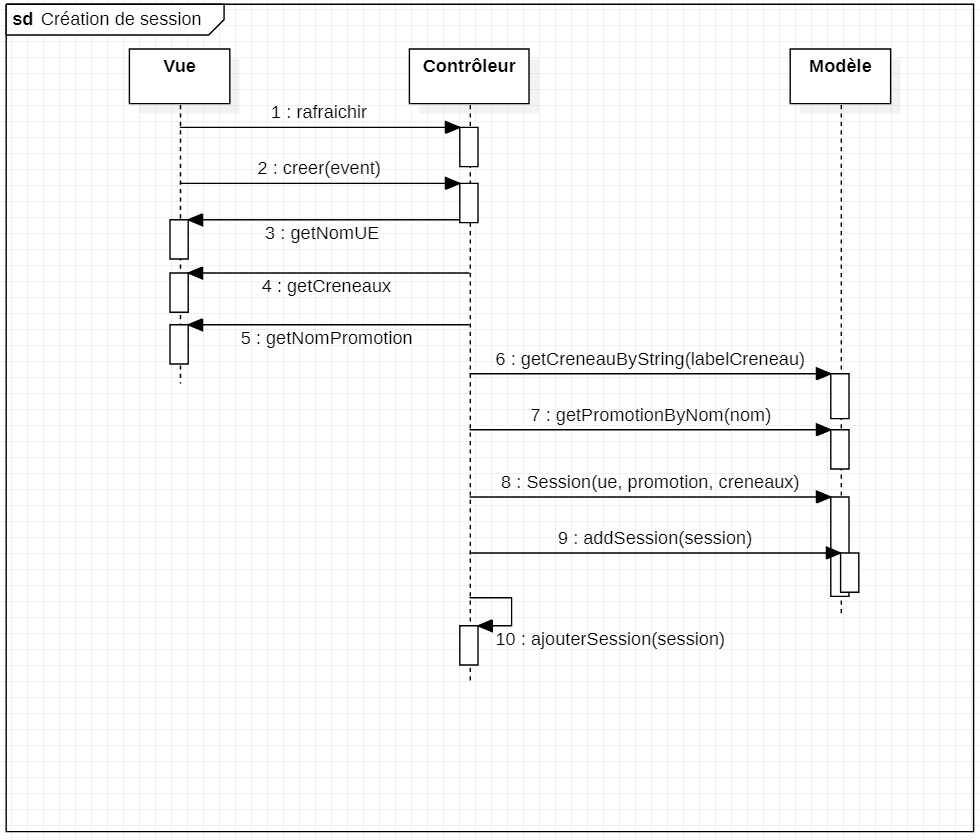

# GestionEcole

GestionEcole est un programme permettant de gérer un établissement scolaire. Le logiciel actuel comprend la gestion des créneaux, des promotions et des unités d'enseignement. Il comprend également la gestion de sessions (créneaux + une promotion + une UE).

## Installation

Dans Eclipse, importer le projet : File > Import, choisir "Existing Maven projects".
Choisir ensuite le dossier du projet puis vérifier que le fichier `pom.xml` est coché avant de valider.

     
Il faut ensuite construire le `.jar`.

Dans le menu Run, sélectionner "Run Configurations..." et créer une configuration de type "Maven Build".

Pour le champs "Base Directory", choisir le dossier du projet. Le champs "Goals" doit comporter la valeur "clean package" : s'il y a eu une précédente génération de `.jar`, les fichiers concernés seront remplacés par la nouvelle installation.

Valider et exécuter cette configuration : Maven installe les dépendances nécessaires et créé ensuite un dossier `target` dans le dossier du projet. Le fichier `.jar` de cette application est dans le répertoire `target/modules/` en compagnie des `.jar` nécessaires au fonctionnement de JavaFX.
Le logiciel peut être lancé grâce à un script présent dans `target/`.

### Windows

Lancer le script `runme.bat` à l'aide d'un double-clic, ou bien en tapant la commande `.\runme.bat` dans un terminal.

### macOS et Linux

Vérifier d'abord que les droits d'exécution sont disponible pour le script `runme.sh` à l'aide de la commande `ls -l`.
Si les droits d'exécution ne sont pas disponibles pour l'utilisateur, taper la commande `chmod a+x runme.sh` : les droits d'exécution seront disponibles pour tout utilisateur.
Exécuter ensuite le script avec la commande `./runme.sh`.

## Désinstallation

Pour désinstaller cette application, il y a deux méthodes :
- créer une configuration de type Maven Build, de la même manière qu'à l'installation, en inscrivant dans le champs Goals la valeur "clean" : le lancement de cette configuration permettra à Maven de supprimer le dossier `target`
- supprimer manuellement le dossier `target` contenu dans le dossier de projet

## Environnement

Ce programme doit être executé sur un ordinateur fonctionnant sous Windows, Linux ou bien macOS.
La machine doit disposer de Java 11.

## Exemples de cheminement

### Création d'un créneau

     
### Création d'une session

## Exigences

### Satisfaites
- Req-ses-01 : L'utilisateur peut créer une Unité d'Enseignement
- Req-ses-02 : L'utilisateur peut supprimer une Unité d'Enseignement.
- Req-ses-03 : L'utilisateur peut créer un créneau (temporel).
- Req-ses-04 : L'utilisateur peut supprimer un créneau (temporel).
- Req-ses-05 : L'utilisateur peut créer une classe (promo).
- Req-ses-06 : L'utilisateur peut supprimer une classe (promo).
- Req-ses-07 : L'utilisateur peut créer une session (UE – classe - créneau).
- Req-ses-08 : L'utilisateur peut supprimer une session (UE – classe – créneau).
- Req-ses-09 : L'utilisateur peut changer une session de créneau temporel.
- Req-ses-10 : L'utilisateur peut créer des sessions sur un ensemble de créneaux.
- Req-doc-04 : La documentation doit décrire l'environnement matériel nécessaire à l'installation.
- Req-doc-05 : La documentation doit décrire l'environnement logiciel nécessaire à l'installation.
- Req-doc-06 : La documentation doit décrire le cheminement des appels de fonctions pour 2 fonctionnalités.
- Req-doc-07 : La documentation doit lister les exigences satisfaites.
- Req-doc-08 : La documentation doit lister les exigences non satisfaites.
- Req-doc-01 : La documentation doit décrire la procédure d'installation.
- Req-doc-02 : La documentation doit décrire la procédure de désinstallation.
- Req-doc-09 : La documentation doit lister les anomalies.
- Req-doc-10 : La documentation doit décrire la procédure de compilation.
- Req-exp-01 : Le système doit fonctionner sous Linux.
- Req-exp-02 : Le système doit fonctionner sous Windows.
- Req-exp-03 : Le système doit fonctionner sous Mac OS.
- Req-exp-04 : Le système doit être développé en Java 11
- Req-liv-01 : La livraison doit contenir tous les éléments nécessaires à la génération de la version binaire.
- Req-liv-02 : La livraison doit contenir la version binaire du système.
- Req-liv-03 : La livraison doit contenir toute la documentation.
- Req-arc-03 : Les communications entre IHM et fonctions passent par une unique interface Java.
- Req-arc-04 : Les requêtes vont uniquement de l'IHM vers l'objet exposant les fonctions.
- Req-arc-05 : Les opérations exposées par l'interface sont de 4 types : lecture, création, modification, suppression d'un objet.
- Req-fct-01 : Après re-démarrage du système il est dans le même état qu'avant son arrêt (données).
- Req-fct-02 : Il est possible de mettre à jour l'IHM (automatiquement ou à la demande de l'utilisateur)
- Req-arc-07 : L'identifiant des objets créés est attribuée par l'IHM.

### Non satisfaites

- Req-doc-03 : La documentation doit décrire Les entrées et sorties de chaque composant.
- Req-arc-02 : Le programme principal instancie deux objets : l'un implémentant l'IHM et l'autre exposant les fonctionnalités.
- Req-arc-06 : Les classes implémentant l'IHM et les fonctionnalités sont packagées dans des jar distincts.
- Req-arc-01 : Le système est constitué d'un seul exécutable.

## Anomalies

La police d'écriture ne s'affiche pas toujours correctement sous macOS et sous certaines versions mineures du JDK 11. Après des recherches sur Internet, nous avons constaté que c'est un problème récurrent sous macOS pour lequel on ne peut pas apporter de réelle solution.
La sauvegarde peut potentiellement être corrumpue, ce qui provoquera un dysfonctionnement.

## Procédure de compilation

Depuis Eclipse, le projet peut être lancé en tant que Java Application. Pour cela, il faut aller dans le menu "Run". Dans le sous menu "Run Configurations", il faut créer une nouvelle configuration de type Java Application.
Le projet à choisir est "GestionEcole", et la classe principale est MainApp (package `fr.uvsq.isty.gestionecole`).

## Javadoc
La Javadoc de cette application est située dans le répertoire suivant : `target/site/apidocs`. Pour visionner le contenu de cette documentation, ouvrir le fichier `ìndex.html` dans un navigateur.